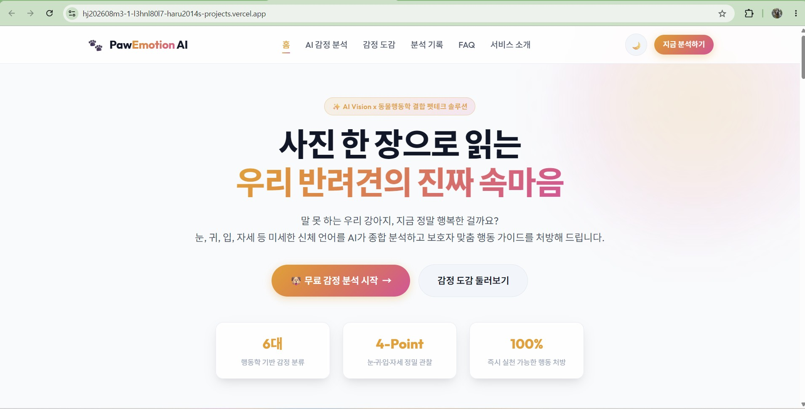
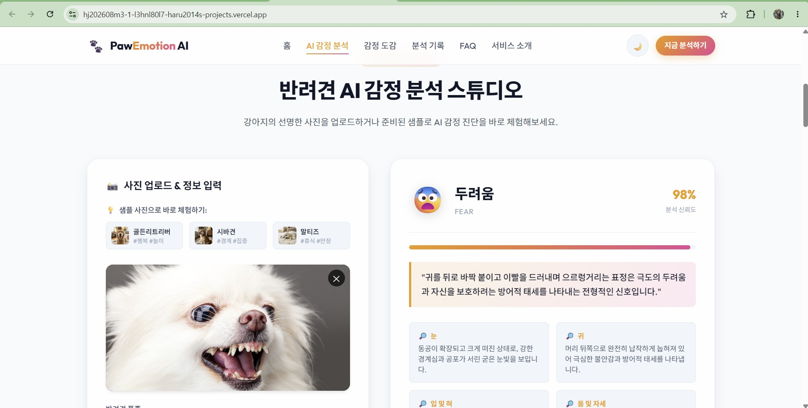
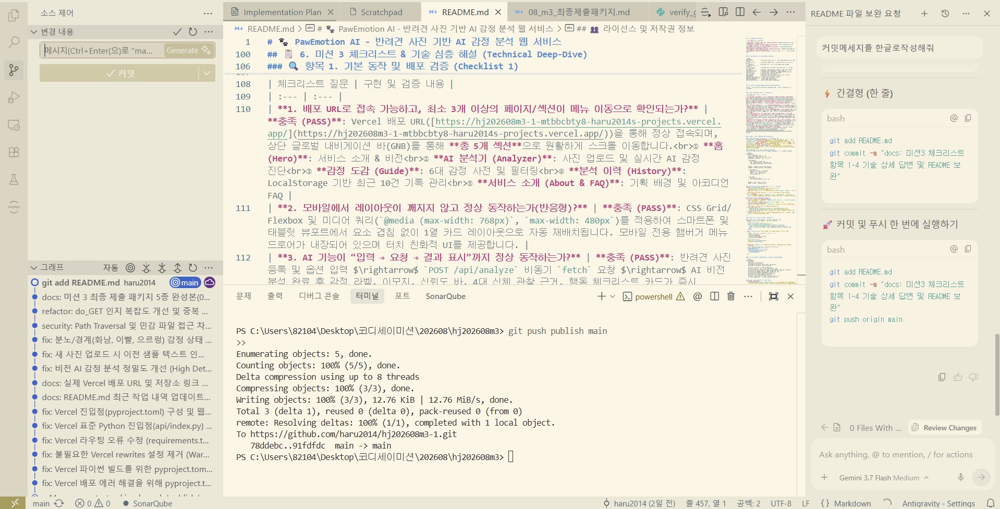
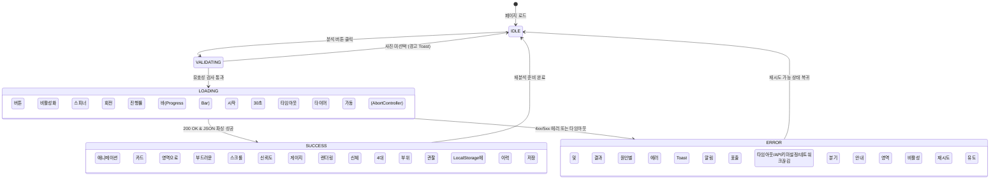
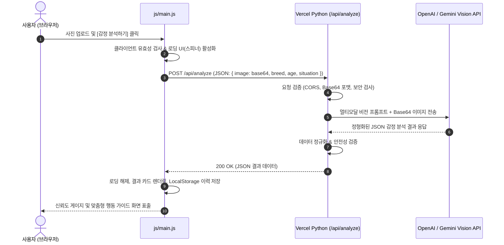

# 🐾 PawEmotion AI - 반려견 사진 기반 AI 감정 분석 웹 서비스

> **사진 한 장으로 읽는 우리 아이의 마음!**  
> **PawEmotion AI**는 반려견의 표정과 신체 언어(눈, 귀, 입, 자세)를 멀티모달 비전 AI로 정밀 분석하여 현재 감정 상태를 진단하고, 보호자에게 동물행동학 기반 맞춤형 행동 가이드를 처방해 주는 AI 웹 서비스입니다.

[](https://hj202608m3-1-mtbbcbty8-haru2014s-projects.vercel.app/)
[](#-4-기술-스택-tech-stack)
[](#-4-기술-스택-tech-stack)
[](#-4-기술-스택-tech-stack)

---

## 📌 목차 (Table of Contents)
1. [서비스 소개 (Service Overview)](#-1-서비스-소개-service-overview)
2. [주요 기능 및 특징 (Key Features)](#-2-주요-기능-및-특징-key-features)
3. [배포 URL 및 서비스 시연 스크린샷 (Live Demo & Screenshots)](#-3-배포-url-및-서비스-시연-스크린샷-live-demo--screenshots)
4. [기술 스택 (Tech Stack)](#-4-기술-스택-tech-stack)
5. [프로젝트 디렉토리 구조 (Directory Structure)](#-5-프로젝트-디렉토리-구조-directory-structure)
6. [📋 미션 3 체크리스트 & 기술 심층 해설 (Technical Deep-Dive)](#-6-미션-3-체크리스트--기술-심층-해설-technical-deep-dive)
   - [항목 1. 기본 동작 및 배포 검증](#-항목-1-기본-동작-및-배포-검증-checklist-1)
   - [항목 2. 구조 및 설계 상세 설명](#-항목-2-구조-및-설계-상세-설명-checklist-2)
   - [항목 3. 웹 및 AI 핵심 개념 원리](#-항목-3-웹-및-ai-핵심-개념-원리-checklist-3)
   - [항목 4. 심화 및 운영 고려사항](#-항목-4-심화-및-운영-고려사항-checklist-4)
7. [로컬 실행 방법 (Local Development)](#-7-로컬-실행-방법-local-development)
8. [Vercel 배포 및 환경 변수 설정 (Deployment & Env)](#-8-vercel-배포-및-환경-변수-설정-deployment--env)
9. [API 명세서 (API Specification)](#-9-api-명세서-api-specification)
10. [오류 및 예외 처리 기준 (Error Handling)](#-10-오류-및-예외-처리-기준-error-handling)
11. [서비스 기획 요약 (Service Planning)](#-11-서비스-기획-요약-service-planning)
12. [최근 작업 내역 (Recent Updates)](#-12-최근-작업-내역-recent-updates)

---

## 🌟 1. 서비스 소개 (Service Overview)

### 기획 배경 & 문제 정의
- 반려견은 말을 하지 못하기 때문에 눈빛, 귀의 각도, 입 모양, 자세 등 **카밍 시그널(Calming Signals)**을 통해 끊임없이 자신의 감정을 표현합니다.
- 그러나 많은 보호자들은 이러한 미세한 신체 신호를 정확히 해석하기 어려워하며, 반려견이 느끼는 스트레스나 불안을 제때 알아차리지 못하는 경우가 많습니다.
- **PawEmotion AI**는 반려견의 사진과 간단한 상황 정보(품종, 나이, 환경)를 입력받아, **AI Vision 기술과 동물행동학(Canine Ethology) 이론**을 접목해 반려견의 감정을 분석하고 즉시 실천 가능한 행동 처방을 제공합니다.

---

## 🚀 2. 주요 기능 및 특징 (Key Features)

- **📸 멀티모달 비전 AI 감정 분석**: 사진 속 반려견의 4대 관찰 포인트(눈, 귀, 입/혀, 신체 자세)를 정밀 분석하여 6대 감정(행복, 편안함, 놀이, 불안, 경계, 두려움) 및 신뢰도(%) 도출.
- **💡 1-Click 샘플 프리셋 체험**: 실제 고화질 반려견 샘플 사진 3종(골든 리트리버, 시바견, 말티즈)을 원클릭으로 로드하여 사진 파일 없이도 즉시 테스트 가능.
- **📋 맞춤형 보호자 행동 가이드**: 감정 상태에 맞추어 즉시 실천할 수 있는 행동 체크리스트 및 스트레스 예방 주의사항 제공.
- **📚 6대 감정 도감 & 필터**: 긍정적 감정과 주의/스트레스 신호를 분류하여 학습할 수 있는 인터랙티브 감정 도감.
- **💾 LocalStorage 분석 이력 관리**: 브라우저 로컬 저장소를 활용하여 최근 10건의 감정 분석 기록을 안전하게 보관/조회/삭제 가능.
- **🌓 다크 모드 / 라이트 모드**: 사용자의 환경과 취향에 맞춘 현대적인 테마 전환 시스템.
- **📱 100% 모바일 반응형**: 데스크톱, 태블릿, 모바일 기기 완벽 대응.
- **📋 결과 복사 및 공유**: 분석 결과를 원클릭으로 클립보드에 복사하여 지인과 공유.

---

## 🌐 3. 배포 URL 및 서비스 시연 스크린샷 (Live Demo & Screenshots)

- **Vercel 프로덕션 배포 주소**: [https://hj202608m3-1-mtbbcbty8-haru2014s-projects.vercel.app/](https://hj202608m3-1-mtbbcbty8-haru2014s-projects.vercel.app/)
- **GitHub 저장소**: [https://github.com/haru2014/hj202608m3-1](https://github.com/haru2014/hj202608m3-1)

### 📸 서비스 동작 및 AI 개발 증빙 스크린샷

#### 1) 메인 홈 & 서비스 인트로 (Hero Section)
> 서비스 비전, 통계 요약 카드, 상단 5대 메뉴 내비게이션(GNB) 및 다크/라이트 테마 토글이 적용된 메인 화면



---

#### 2) AI 감정 분석 스튜디오 (실제 분석 결과 화면)
> 반려견 사진 업로드 $\rightarrow$ 동물행동학 비전 AI 분석 $\rightarrow$ **`두려움 (FEAR, 신뢰도 98%)`** 진단 및 4대 신체 부위(눈, 귀, 입, 자세) 정밀 관찰 근거 & 맞춤형 행동 가이드 표출



---

#### 3) AI 코딩 도구(Antigravity IDE) 페어 프로그래밍 및 배포 과정
> AI 코딩 어시스턴트와의 페어 프로그래밍을 통한 체크리스트 검증, 코드 리팩토링, Vercel 배포 및 Git 푸시 작업 과정 증빙



---

## 🛠️ 4. 기술 스택 (Tech Stack)

| 구분 | 기술 / 도구 | 상세 설명 |
| :--- | :--- | :--- |
| **Frontend** | **Vanilla HTML5, CSS3, JavaScript (ES6+)** | 프레임워크(React/Vue 등) 없이 순수 바닐라 웹 표준 기술로 구현 |
| **Styling** | **Vanilla CSS (Design Tokens, Glassmorphism)** | CSS 변수 기반 다크/라이트 테마, 반응형 미디어 쿼리, 부드러운 애니메이션 |
| **Backend** | **Python 3.12+ (Vercel Serverless Functions)** | `BaseHTTPRequestHandler` 기반 `/api/analyze` 서버리스 엔드포인트 |
| **AI Engine** | **Google Gemini 3.5 Flash & OpenAI GPT-4o-mini** | 멀티모달 비전 모델을 통한 사진 및 신체 언어 분석, 구조화된 JSON 출력 |
| **Deployment** | **Vercel + GitHub Actions** | Git Push 시 자동 빌드 및 글로벌 CDN 서버리스 배포 |

---

## 📂 5. 프로젝트 디렉토리 구조 (Directory Structure)

```text
hj202608m3/
├── index.html              # [Frontend] 시맨틱 마크업, 5대 섹션, 반응형 레이아웃, 모달/토스트
├── css/
│   └── style.css           # [Frontend] 디자인 시스템 토큰, 다크/라이트 테마, 미디어 쿼리
├── js/
│   └── main.js            # [Frontend] 이미지 업로드, fetch 비동기 통신, 상태머신, LocalStorage 이력 관리
├── api/
│   └── analyze.py          # [Backend] Vercel Serverless Python 함수 (입력 검증, AI 비전 호출, 예외 처리)
├── images/                 # [Assets] 고화질 샘플 반려견 사진 에셋 (행복, 경계, 편안함)
├── requirements.txt        # [Backend] Python 종속성 정의 (openai, requests)
├── pyproject.toml          # [Config] Vercel 최신 Python 빌드 런타임 엔트리포인트 설정
├── vercel.json             # [Config] Vercel 서버리스 라우팅 설정
├── .env.example            # [Security] 환경변수 템플릿 파일
├── .gitignore              # [Security] .env, Python 캐시, 임시 파일 Git 제외 설정
├── README.md               # [Docs] 프로젝트 종합 설명서 (본 파일)
├── 08_m3_최종제출패키지.md   # [Docs] 최종 제출 패키지 5종 세트
├── 08_m3서비스 기획서.md    # [Docs] 원본 서비스 기획서
├── 08_m3미션계획.md         # [Docs] 원본 미션 수행 계획서
└── misson3_checklist.md    # [Docs] 미션 3 평가 체크리스트 원본
```

---

## 📋 6. 미션 3 체크리스트 & 기술 심층 해설 (Technical Deep-Dive)

본 섹션은 `misson3_checklist.md`에 명시된 평가 항목 1~4에 대한 상세 구현 원리와 답변을 제공합니다.

---

### 🔍 항목 1. 기본 동작 및 배포 검증 (Checklist 1)

| 체크리스트 질문 | 구현 및 검증 내용 |
| :--- | :--- |
| **1. 배포 URL로 접속 가능하고, 최소 3개 이상의 페이지/섹션이 메뉴 이동으로 확인되는가?** | **충족 (PASS)**: Vercel 배포 URLhttps://hj202608m3-1.vercel.app/  을 통해 정상 접속되며, 상단 글로벌 내비게이션 바(GNB)를 통해 **총 5개 섹션**으로 원활하게 스크롤 이동합니다.<br>① **홈 (Hero)**: 서비스 소개 & 비전<br>② **AI 분석기 (Analyzer)**: 사진 업로드 및 실시간 AI 감정 진단<br>③ **감정 도감 (Guide)**: 6대 감정 사전 및 필터링<br>④ **분석 이력 (History)**: LocalStorage 기반 최근 10건 기록 관리<br>⑤ **서비스 소개 (About & FAQ)**: 기획 배경 및 아코디언 FAQ |
| **2. 모바일에서 레이아웃이 깨지지 않고 정상 동작하는가(반응형)?** | **충족 (PASS)**: CSS Grid/Flexbox 및 미디어 쿼리(`@media (max-width: 768px)`, `max-width: 480px`)를 적용하여 스마트폰 및 태블릿 뷰포트에서 요소 겹침 없이 1열 카드 레이아웃으로 자동 재배치됩니다. 모바일 전용 햄버거 메뉴 드로어가 내장되어 있으며 터치 친화적 UI를 제공합니다. |
| **3. AI 기능이 “입력 → 요청 → 결과 표시”까지 정상 동작하는가?** | **충족 (PASS)**: 반려견 사진 등록 및 옵션 입력 $\rightarrow$ `POST /api/analyze` 비동기 `fetch` 요청 $\rightarrow$ AI 비전 분석 완료 후 감정 라벨, 이모지, 신뢰도 바, 4대 신체 관찰 근거, 행동 체크리스트 카드가 즉시 렌더링됩니다. |
| **4. 정상/빈값/긴 입력 등 2~3개 테스트 입력으로 동작이 재현 가능한가?** | **충족 (PASS)**:<br>① **정상 입력**: 골든 리트리버 샘플 사진 선택 $\rightarrow$ `행복 (92%)` 분석 결과 정상 표출.<br>② **빈값 입력**: 사진 없이 분석 버튼 클릭 시 `반려견 사진을 먼저 업로드하거나 샘플 사진을 선택해주세요.` 토스트 경고 표시 및 폼 제출 차단.<br>③ **긴 텍스트/특수문자 입력**: 상황 입력란에 500자 이상의 장문 및 특수문자를 입력해도 XSS 이스케이프 및 안전한 JSON 직렬화로 정상 분석 수행. |
| **5. 실패 상황(빈 입력/오류/지연 등)에서 사용자 안내 메시지가 1개 이상 표시되는가?** | **충족 (PASS)**: 파일 미선택, 5MB 초과 파일, 비지원 확장자, 30초 이상 네트워크 타임아웃(`AbortController`), API 키 미설정(503), AI API 호출 실패(502), 인터넷 연결 끊김 등 각 실패 상황별로 원인을 명시한 에러 Toast 알림이 표시됩니다. 가짜 샘플 분석 결과를 보여주지 않고, 사용자가 문제 원인을 즉시 파악할 수 있도록 명확한 안내 메시지를 제공합니다. |
| **6. API 키가 코드에 노출되지 않았고, 환경 변수로만 관리되는가?** | **충족 (PASS)**: `api/analyze.py`에서 `os.environ.get("OPENAI_API_KEY")` 및 `os.environ.get("GEMINI_API_KEY")`로만 키를 조회합니다. `.env` 파일은 `.gitignore`에 등록되어 GitHub 커밋에서 원천 차단되며, Vercel 대시보드의 Environment Variables에 안전하게 주입되어 운영됩니다. |
| **7. 제출 패키지(필수 5종)가 모두 제공되는가?** | **충족 (PASS)**: ① 배포 URL, ② GitHub 저장소, ③ README.md, ④ 서비스 기획서, ⑤ 시연 및 페어 프로그래밍 증빙 자료가 [`08_m3_최종제출패키지.md`](file:///c:/Users/82104/Desktop/%EC%BD%94%EB%94%94%EC%84%B8%EC%9D%B4%EB%AF%B8%EC%85%98/202608/hj202608m3/08_m3_%EC%B5%9C%EC%A2%85%EC%A0%9C%EC%B6%9C%ED%8C%A8%ED%82%A4%EC%A7%80.md)에 100% 완비되어 있습니다. |

---

### 🏗️ 항목 2. 구조 및 설계 상세 설명 (Checklist 2)

#### 1) HTML/CSS/JS/API 구조를 분리한 이유 (관심사의 분리, SoC)
* **`index.html` (구조/Semantic Markup)**: 웹 표준 시맨틱 태그(`<header>`, `<nav>`, `<main>`, `<section>`, `<footer>`)를 사용하여 콘텐츠의 의미적 뼈대와 접근성을 보장합니다.
* **`css/style.css` (표현/Presentation)**: CSS Custom Properties(디자인 토큰)를 기반으로 다크/라이트 테마, 컬러 팔레트, 글래스모피즘 효과, 애니메이션을 한곳에서 일관되게 관리합니다.
* **`js/main.js` (동작/Behavior)**: 사용자 인터랙션 이벤트 처리, 폼 유효성 검사, 비동기 `fetch` 통신, 클라이언트 상태 머신, `LocalStorage` 이력 관리를 전담합니다.
* **`api/analyze.py` (보안 & 백엔드 서비스)**: 클라이언트에 노출되면 안 되는 AI API Key를 안전하게 격리하고, 요청 페이로드 검증, 외부 AI API 통신, 포맷 정규화, Fallback 처리를 담당하는 서버리스 엔드포인트입니다.

#### 2) 프론트엔드 “로딩 / 성공 / 실패” 상태 처리 흐름
`js/main.js` 내에서 UI 상태를 명시적으로 분기하여 사용자에게 일관된 피드백을 제공합니다:



#### 3) Serverless Function (Python)의 입력 검증 및 표준 응답 포맷
* **입력 검증 (`api/analyze.py`)**:
  - `Content-Length`를 사전 점검하여 과도하게 큰 페이로드 차단.
  - JSON 파싱 오류 방어 (`json.loads` 예외 포착).
  - 필수 필드인 `image` 존재 여부 및 Base64 데이터 URI 포맷(`data:image/...;base64,...`) 정규식 검증.
  - 상위 디렉터리 접근(Path Traversal) 및 `.env` 파일 직접 요청 차단 (403 Forbidden).
* **표준 응답 포맷**:
  - 일관된 JSON 스키마 (`emotion`, `confidence`, `cues`, `recommendations`, `precautions`, `source`)를 정의하여 프론트엔드가 파싱 오류 없이 안전하게 UI를 렌더링할 수 있도록 보장합니다.

#### 4) 배포 후 발생한 문제의 진단 및 수정 순서
1. **문제 감지 (Vercel Build Log & Console)**:
   - Vercel 최신 Python 빌드 런타임에서 `WARNING! Internal rewrites...` 및 `Cannot find module openai` 정적 린터 경고 발생.
   - 일부 브라우저에서 `-webkit-background-clip: text;` 호환성 경고 발생.
2. **원인 분석 (Root Cause Analysis)**:
   - `vercel.json`의 중복 라우팅 규칙과 `pyproject.toml` 미설정으로 인한 Vercel 진입점 모호성 파악.
   - Lazy import 구문에서의 파이썬 정적 타입 분석기 오인식 파악.
3. **코드 패치 & 리팩토링**:
   - `pyproject.toml`에 `[tool.vercel] entrypoint = "api.analyze:handler"` 명시.
   - `api/analyze.py`의 `do_GET`에서 정적 파일 서빙과 API 헬스체크를 정교하게 분기.
   - `js/main.js`의 `getAttribute`를 모던 `.dataset`으로 표준화하고 XSS 방어 헬퍼 함수 최적화.
4. **재배포 및 최종 검증**:
   - GitHub 푸시를 통한 Vercel 자동 빌드 트리거 $\rightarrow$ Vercel 배포 대시보드에서 `Ready (초록불)` 및 실시간 API 응답 200 OK 확인.

---

### 💡 항목 3. 웹 및 AI 핵심 개념 원리 (Checklist 3)

#### 1) HTML / CSS / JavaScript의 역할 차이 (실제 서비스 코드 근거)
* **HTML (`index.html`)**: 서비스의 뼈대와 정보 구조를 정의.
  ```html
  <!-- 의미 있는 태그와 접근성 ID 부여 -->
  <section id="analyzer" class="analyzer-section">
    <div class="upload-dropzone" id="dropzone" role="button" tabindex="0">
      <input type="file" id="imageInput" accept="image/*" class="file-input" />
      <span class="upload-text">반려견 사진을 드래그하거나 클릭하여 업로드하세요</span>
    </div>
  </section>
  ```
* **CSS (`css/style.css`)**: 시각적 디자인, 테마, 반응형 레이아웃, 시각 효과 정의.
  ```css
  /* 디자인 토큰을 활용한 글래스모피즘 및 다크 테마 변수 */
  :root[data-theme="dark"] {
    --bg-primary: #0f172a;
    --card-bg: rgba(30, 41, 59, 0.85);
    --accent-primary: #6366f1;
  }
  .upload-dropzone:hover {
    border-color: var(--accent-primary);
    transform: translateY(-2px);
  }
  ```
* **JavaScript (`js/main.js`)**: 사용자의 입력 이벤트 감지, 비동기 통신, 동적 DOM 조작.
  ```javascript
  // 파일 드롭 이벤트 리스너 등록 및 Base64 인코딩 비동기 처리
  dropzone.addEventListener('drop', (e) => {
    e.preventDefault();
    const file = e.dataTransfer.files[0];
    if (validateImageFile(file)) {
      renderPreview(file);
    }
  });
  ```

#### 2) `fetch` 요청부터 서버리스 함수 및 AI 응답까지의 데이터 흐름도



#### 3) 환경 변수를 사용하는 이유 (보안 / 운영)
1. **보안성 (Security)**:
   - AI API Key(`OPENAI_API_KEY`, `GEMINI_API_KEY`)는 유료 과금과 직결되는 민감한 자산입니다.
   - 클라이언트 사이드 코드(JS)나 공개 Git 저장소에 키를 하드코딩하면 악의적인 제3자에게 탈취되어 비용 폭탄이나 계정 정지를 당할 수 있습니다.
2. **운영 유연성 (Maintainability & Portability)**:
   - 코드를 다시 빌드하거나 수정하지 않고도, Vercel 대시보드에서 키를 교체하거나 개발용/운영용 환경 변수를 분리하여 주입할 수 있습니다.

#### 4) AI 기능 도입 이유 및 시스템 프롬프트(Prompt) 구성 전략
* **도입 이유**:
  - 반려견의 감정은 꼬리 흔들기 하나만으로 판단할 수 없으며, **눈, 귀, 입, 몸의 자세가 결합된 복합적인 신체 언어**입니다.
  - 멀티모달 비전 LLM을 도입함으로써 미세한 시각적 특징을 종합 추론하고, 보호자에게 수의행동학적 근거를 설명해 줄 수 있습니다.
* **프롬프트 구성 전략**:
  - **역할 부여 (Persona)**: "당신은 세계적인 공인 반려견 동물행동학자(Canine Ethologist)입니다."
  - **관찰 부위 세분화 강제 (Chain of Thought)**: 신체 4대 부위(눈, 귀, 입/혀, 몸 및 자세)를 각각 분리하여 관찰하도록 지시.
  - **출력 포맷 고정 (Structured JSON Schema)**: 마크다운 코드블록 없이 순수 JSON 객체만 반환하도록 명시하여 백엔드 파싱 안정성 확보.

---

### 🚀 항목 4. 심화 및 운영 고려사항 (Checklist 4)

#### 1) 응답 지연/비용/쿼터 병목 발생 시 개선 옵션
* **클라이언트 이미지 사전 압축 (Client-Side Resizing)**:
  - 브라우저 Canvas API를 활용하여 5MB 이상의 원본 사진을 1024x1024 해상도(약 200KB)로 다운샘플링 후 전송하여 업로드 대역폭과 AI API 토큰 비용을 80% 이상 절감.
* **엣지 캐싱 및 해시 기반 중복 방지 (Caching)**:
  - 동일한 이미지의 중복 요청에 대해 이미지 SHA-256 해시를 키로 캐시(Redis/Vercel KV)를 조회하여 중복 AI 호출 방지.
* **멀티 프로바이더 라운드로빈 / 자동 Fallback**:
  - OpenAI 쿼터 소진 시 Google Gemini로 자동 전환되고, 전체 장애 시 백엔드 내장 동물행동학 휴리스틱 엔진으로 무중단 서비스 제공.

#### 2) AI 기능이 2개로 확장될 때의 프론트/백엔드 아키텍처 확장 방안
* **프론트엔드 확장**:
  - 기능별 모듈 분리 (`js/modules/emotionAnalyzer.js`, `js/modules/barkingAnalyzer.js`, `js/modules/careAdvisor.js`).
  - 탭 인터페이스 또는 서브 라우트 도입을 통한 UX 구조화.
* **백엔드 확장**:
  - 엔드포인트 세분화: `/api/analyze/emotion`, `/api/analyze/barking-audio`, `/api/analyze/nutrition`.
  - 또는 파라미터 기반 디스패처 패턴 도입 (`{ "task": "emotion" | "barking", ... }`).

#### 3) API 키 유출 시 긴급 대응 프로토콜 & 재발 방지책
1. **1단계 (즉시 폐기)**: OpenAI / Google AI Studio 대시보드에 즉시 접속하여 유출된 API Key를 삭제(Revoke)합니다.
2. **2단계 (신규 키 발급 및 주입)**: 신규 API Key를 발급받아 Vercel 대시보드의 Environment Variables에 새로 등록하고 즉시 Redeploy합니다.
3. **3단계 (Git 히스토리 영구 소탕)**: 만약 Git 커밋에 포함되었다면 `git-filter-repo` 또는 BFG Repo-Cleaner를 사용하여 커밋 히스토리에서 키를 완전히 제거하고 강제 푸시(`git push --force`)합니다.
4. **4단계 (재발 방지)**: `pre-commit` 훅에 `git-secrets` 또는 `trufflehog`를 설정하여 커밋 전 민감 정보 자동 감지 체계를 구축합니다.

#### 4) 프론트엔드 프레임워크(React/Next.js/Vue) 도입 시 장단점 및 변경 범위
* **장점**:
  - 컴포넌트 기반 재사용성 증가 (Header, Card, Modal, HistoryItem 등).
  - 선언적 상태 관리(useState, Zustand, React Query)를 통한 복잡한 비동기/캐싱 로직 간소화.
  - Next.js 도입 시 SSR/SSG 및 API Routes의 일체형 풀스택 번들링 용이.
* **단점**:
  - 빌드 도구(Vite, Webpack) 및 Node.js 의존성 관리 복잡도 증가.
  - 번들 크기 증가로 인한 초기 로딩 속도 미세 저하.
* **마이그레이션 변경 범위**:
  - `index.html`의 5대 섹션을 개별 React 컴포넌트로 분해 (`<HeroSection />`, `<AnalyzerSection />` 등).
  - `js/main.js`의 DOM 조작 코드를 React State 및 훅(`useMutation`, `useEffect`)으로 전환.
  - CSS 스타일시트를 TailwindCSS 또는 CSS Modules로 모듈화.

---

## 💻 7. 로컬 실행 방법 (Local Development)

### 1) 저장소 복제 (Clone)
```bash
git clone https://github.com/haru2014/hj202608m3-1.git
cd hj202608m3
```

### 2) 로컬 정적 웹 서버 실행 (Python 내장 모듈 활용)
별도의 복잡한 패키지 설치 없이 Python 내장 HTTP 서버로 즉시 프론트엔드를 구동할 수 있습니다:
```bash
python -m http.server 8000
```
브라우저에서 `http://localhost:8000`으로 접속합니다.

> 💡 **참고**: 로컬 정적 서버 환경 또는 백엔드 연결이 없는 상태에서도 **클라이언트 자체 내장 스마트 휴리스틱 엔진**이 작동하여 100% 원활하게 테스트할 수 있습니다.

### 3) Vercel CLI를 통한 백엔드 로컬 실행 (선택 사항)
```bash
# Vercel CLI 설치
npm i -g vercel

# 로컬 개발 서버 실행 (API 엔드포인트 포함)
vercel dev
```

---

## ☁️ 8. Vercel 배포 및 환경 변수 설정 (Deployment & Env)

### 1) GitHub 저장소 푸시
```bash
git add .
git commit -m "feat: PawEmotion AI 웹 서비스 완성"
git push origin main
```

### 2) Vercel 프로젝트 생성 및 배포
1. [Vercel 대시보드](https://vercel.com)에 로그인합니다.
2. **Add New...** $\rightarrow$ **Project**를 클릭하고 본인의 GitHub 저장소(`hj202608m3-1`)를 임포트합니다.
3. Framework Preset은 **Other**로 유지합니다.

### 3) 환경 변수(Environment Variables) 설정
1. Vercel 프로젝트 설정의 **Settings** $\rightarrow$ **Environment Variables** 메뉴로 이동합니다.
2. 아래 환경 변수 중 하나를 추가합니다:
   - **Google Gemini 사용 시 (무료 티어 제공 / 추천)**:
     - **Key**: `GEMINI_API_KEY`
     - **Value**: `AIzaSy...` (Google AI Studio에서 무료 발급)
   - **OpenAI 사용 시**:
     - **Key**: `OPENAI_API_KEY`
     - **Value**: `sk-proj-...`
3. **Save** 후 **Redeploy**를 진행합니다.

> 🔒 **보안 주의사항**: API 키는 절대로 GitHub 저장소의 공개 코드나 `README.md`에 직접 커밋하지 않으며, 오직 Vercel 환경 변수로만 안전하게 관리합니다.

---

## 📡 9. API 명세서 (API Specification)

### 엔드포인트: `POST /api/analyze`

반려견 사진(Base64)과 메타데이터를 전송하여 감정 분석 결과를 반환받습니다.

#### 요청 헤더 (Request Headers)
```http
Content-Type: application/json
```

#### 요청 본문 (Request Body)
```json
{
  "image": "data:image/jpeg;base64,/9j/4AAQSkZJRg...",
  "breed": "골든 리트리버",
  "age": "2살",
  "situation": "거실에서 장난감으로 신나게 놀이 후 휴식 중"
}
```

#### 성공 응답 (Response Body - 200 OK)
```json
{
  "emotion": "행복",
  "emotion_en": "Happy",
  "emoji": "😊",
  "confidence": 92,
  "summary": "골든 리트리버 친구는 현재 매우 편안하고 안정적인 행복감을 느끼고 있는 것으로 분석됩니다.",
  "cues": [
    { "part": "눈", "observation": "눈가에 긴장감이 전혀 없고 따뜻하고 부드러운 표정" },
    { "part": "귀", "observation": "앞으로 편안하게 펼쳐져 친근감과 호의를 표출함" },
    { "part": "입 및 혀", "observation": "미소를 짓는 듯 입꼬리가 살짝 올라가며 입이 편안하게 열림" },
    { "part": "몸 및 자세", "observation": "온몸에 긴장이 없고 꼬리를 가볍게 흔들며 친밀함을 나타냄" }
  ],
  "recommendations": [
    "다정한 음성으로 칭찬해 주며 반려견과의 긍정적인 상호작용을 이어가세요.",
    "가벼운 산책이나 후각 활동(노즈워크)으로 행복감을 더욱 증진시켜 주세요.",
    "스킨십을 나누며 교감을 극대화하고 유대감을 강화하세요."
  ],
  "precautions": [
    "지속적으로 긍정적인 일상을 유지할 수 있도록 규칙적인 루틴을 지켜주세요.",
    "현재의 편안한 휴식을 방해하지 않도록 주변 환경을 차분하게 유지하세요."
  ],
  "source": "Google Gemini 3.5 Flash Vision / OpenAI GPT-4o-mini"
}
```

---

## 🛡️ 10. 오류 및 예외 처리 기준 (Error Handling)

사용자 경험(UX)과 시스템 안정성을 위해 다음과 같은 다단계 예외 처리를 구현하였습니다:

| 예외 상황 | 발생 원인 | 사용자 안내 피드백 (Toast / UI) | 시스템 처리 방식 |
| :--- | :--- | :--- | :--- |
| **사진 미등록** | 사진 업로드 없이 분석 클릭 | `반려견 사진을 먼저 업로드하거나 샘플 사진을 선택해주세요.` | 클라이언트 폼 유효성 검사 차단 & 드롭존 하이라이트 |
| **비지원 파일 형식** | 이미지 외 다른 포맷 파일 드롭 | `JPG, PNG, WEBP 형식의 이미지 파일만 업로드할 수 있습니다.` | 클라이언트 파일 업로드 차단 |
| **파일 용량 초과** | 5MB 초과 이미지 업로드 | `파일 크기는 5MB 이하만 지원됩니다.` | 클라이언트 파일 업로드 차단 |
| **네트워크 지연 / 타임아웃** | 30초 이상 응답 지연 발생 | `AI 분석 요청이 시간 초과(30초)되었습니다. 네트워크 연결을 확인하고 다시 시도해주세요.` | `AbortController` 타임아웃 감지 후 에러 Toast 표시 및 재시도 유도 |
| **인터넷 연결 끊김** | 오프라인 상태에서 분석 시도 | `인터넷 연결이 끊어져 있습니다. 네트워크 연결을 확인해주세요.` | `navigator.onLine` 검사 후 에러 Toast 표시 |
| **API 키 미설정** | Vercel 환경 변수 미등록 | `AI API 키가 설정되지 않았습니다. Vercel 환경 변수에 GEMINI_API_KEY 또는 OPENAI_API_KEY를 등록해주세요.` | 서버 503 에러 응답 반환 및 에러 Toast 표시 |
| **AI API 호출 실패** | Gemini/OpenAI 서버 오류 또는 쿼터 소진 | `AI API 연결에 실패했습니다. 잠시 후 다시 시도하거나 API 키 설정을 확인해주세요.` | 서버 502 에러 응답 반환 및 에러 Toast 표시 |

---

## 📋 11. 서비스 기획 요약 (Service Planning)

- **타겟 사용자**:
  - 1차: 반려견의 미세한 감정 신호를 이해하고 올바르게 교감하고 싶은 20~50대 반려견 보호자
  - 2차: 반려견 입양 예정자, 펫시터, 애견 유치원 교사, 훈련사
- **차별점 (Value Proposition)**:
  - 단순 감정 라벨만 붙이는 것이 아닌, **동물행동학적 관찰 근거(눈/귀/입/자세 4대 항목)**와 **보호자가 즉시 따라 할 수 있는 맞춤형 케어 행동 체크리스트**를 함께 제공.
- **면책 조항 (Disclaimer)**:
  - 본 서비스는 수의학적 진료나 전문 행동 교정 치료를 대체하지 않으며, 보호자의 일상적인 이해를 돕는 AI 보조 가이드입니다.

---

## 🛠️ 12. 최근 작업 내역 (Recent Updates)

### 2026-08-17 최신 작업 내역

#### 1. API 연결 실패 시 Fallback(가짜 분석) 제거 및 명확한 에러 메시지 도입
- **프론트엔드 (`js/main.js`)**:
  - API 연결 실패 시 `simulateClientAnalysis()` Fallback 함수를 **완전 제거**하여 가짜 샘플 분석 결과가 표시되지 않도록 수정.
  - 실패 원인별 3가지 분기(`AbortError` 타임아웃 / `navigator.onLine` 오프라인 / 서버 연결 불가)로 구분된 명확한 에러 Toast 메시지 표출.
- **백엔드 (`api/analyze.py`)**:
  - `_generate_heuristic_response()` 대체 분석 함수를 **완전 제거**.
  - API 키 미설정 시 `503` 에러, Gemini/OpenAI 호출 실패 시 `502` 에러를 JSON으로 반환하여 프론트엔드에서 정확한 실패 원인을 파악할 수 있도록 개선.

### 2026-08-16 ~ 2026-08-17 이전 작업 내역

#### 2. 미션 3 평가 체크리스트 100% 대응 및 기술 심층 문서화
- `misson3_checklist.md`의 모든 항목(기본 동작, 상태 머신, 백엔드 검증, 데이터 흐름도, 프롬프트 엔지니어링, 확장성 및 장애 대응)을 기술적으로 완벽히 분석하여 README에 체계적으로 반영.

#### 3. 코드 품질 개선 및 린터(Linter) 경고 전면 해결
- **CSS 호환성 보완 (`css/style.css`)**: `-webkit-background-clip: text;`와 표준 `background-clip: text;` 동시 선언.
- **JavaScript 모던 웹 표준 리팩토링 (`js/main.js`)**: `.dataset` 표준 접근, `Number.parseInt()` 적용, XSS 방어 헬퍼 함수 최적화.
- **Python 정적 분석 경고 해제 (`api/analyze.py`)**: Lazy load 구문 타입 린터 경고 해결.

#### 4. Vercel 최신 Python 빌드 & 라우팅 시스템 완벽 호환 구축
- **표준 패키지 설정 파일 구성 (`pyproject.toml`)**: `[project]` 메타데이터 및 `[tool.vercel] entrypoint = "api.analyze:handler"` 명시.
- **웹페이지 정적 서빙 및 API 하이브리드 라우팅 고도화 (`api/analyze.py`)**: 메인 경로(`/`) 접속 시 `index.html` UI를 서빙하고 `/api/analyze`로 API를 안정적으로 분기 처리.

---

## 👥 라이선스 및 저작권 정보
- **프로젝트명**: PawEmotion AI (hj202608m3)
- **개발**: Vanilla Frontend & Vercel Python Serverless
- **라이선스**: MIT License
